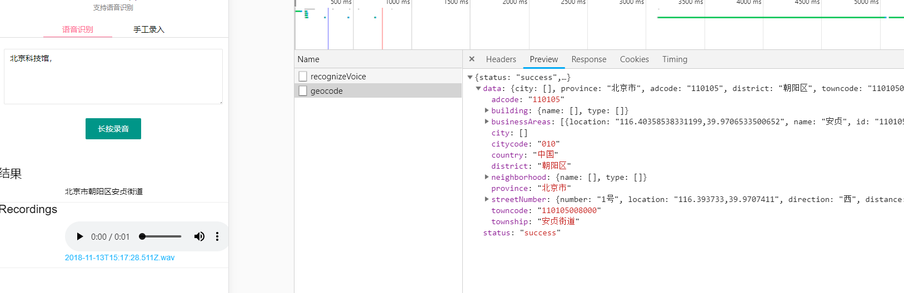

# street-address-search

根据详细地址反查四级地址(地理逆编码)，支持百度语音识别

## Usage

- npm install
- npm run start

open `http://localhost:4100` in browser

说明：

- 录音浏览器原因只支持localhost本地调试使用，以及发布线上只能是https才支持。录音基于[Recorderjs](https://github.com/mattdiamond/Recorderjs)
- 百度语音识别：https://cloud.baidu.com/product/speech

## Screenshot

## License

Apache License

---

> [giscafer.com](http://giscafer.com) &nbsp;&middot;&nbsp;
> GitHub [@giscafer](https://github.com/giscafer) &nbsp;&middot;&nbsp;
> Twitter [@nickbinglao](https://twitter.com/nickbinglao) &nbsp;&middot;&nbsp;
> Weibo [@Nickbing_Lao](https://weibo.com/laohoubin)

